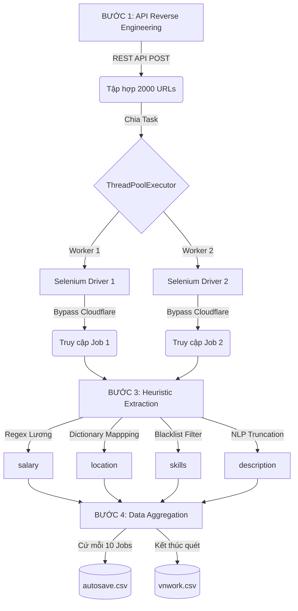

# 🕷️ VietnamWorks Job Crawler (Big Data Pipeline)

Script `vietnamwork.py` là một công cụ cào dữ liệu tự động (Web Scraper) được tinh chỉnh riêng biệt để thu thập dữ liệu thị trường việc làm từ [VietnamWorks](https://vietnamworks.com). Khác với ITviec, VietnamWorks áp dụng công nghệ chống Bot mạnh mẽ (Cloudflare) và ẩn giấu cấu trúc dữ liệu, đòi hỏi hệ thống Crawler phải áp dụng các kỹ thuật Kỹ thuật đảo ngược (Reverse Engineering) và Khai phá dữ liệu (Heuristic Text Mining).

Dữ liệu đầu ra của script này phục vụ trực tiếp cho Đồ án **Phân tích Big Data Thị trường việc làm IT**.

---

## 🎯 Tại sao cào VietnamWorks và Ý nghĩa các trường dữ liệu?

VietnamWorks là nền tảng tuyển dụng lâu đời và đa dạng nhất tại Việt Nam. Nếu ITviec chỉ tập trung vào nhóm lập trình viên kỹ thuật cao, thì VietnamWorks cung cấp bức tranh bao quát hơn về toàn bộ khối ngành IT (kể cả Manager, System Admin, ERP...). Việc kết hợp cả hai nguồn giúp bộ Dataset có tính toàn diện (Comprehensive).

Mỗi bản ghi được thu thập bao gồm **8 trường dữ liệu cốt lõi**, mỗi trường đóng vai trò quan trọng trong việc xây dựng các bài toán Học máy (Machine Learning) và Trực quan hóa dữ liệu (Data Visualization):

| Cột | Ý nghĩa / Vì sao phải cào trường này? |
|---|---|
| `title` | **Tiêu đề công việc:** Dùng để phân tích các vị trí/ngách công việc đang hot (vd: AI Engineer, Backend Dev). |
| `company` | **Tên công ty:** Dùng để thống kê Top công ty tuyển dụng nhiều nhất, quy mô doanh nghiệp. |
| `salary` | **Mức lương:** Trường quan trọng nhất! Dùng để vẽ biểu đồ so sánh mặt bằng lương theo cấp bậc, vị trí và công ty. |
| `location` | **Địa điểm:** Dùng để phân tích xu hướng tuyển dụng theo vùng miền (HN/HCM/ĐN) hoặc xu hướng làm việc Remote. |
| `description` | **Mô tả công việc:** Dùng cho NLP (Xử lý ngôn ngữ tự nhiên) để trích xuất thêm các yêu cầu ẩn, năm kinh nghiệm, hoặc tính toán độ khó của công việc. |
| `skills` | **Kỹ năng:** Phục vụ biểu đồ Top Kỹ Năng, mạng lưới kết nối kỹ năng (PageRank), và phân tích TF-IDF. |
| `url` | **Link gốc:** Dùng làm định danh (ID) để tránh trùng lặp dữ liệu (Deduplication) và cho phép người dùng click xem chi tiết. |
| `crawl_time` | **Thời gian cào:** Quản lý phiên bản dữ liệu (Version Control) và theo dõi biến động thị trường theo thời gian. |

---

## 🔄 Phân tích Chuyên sâu Pipeline (Kiến trúc Hệ thống)

Cấu trúc luồng chạy của hệ thống không dùng kỹ thuật cào đơn thuần mà áp dụng Kiến trúc Đa luồng (Multi-threading) và Vượt tường lửa.



### Bước 1 – Thu thập URL bằng Dịch ngược (API Reverse Engineering)
Khác với thao tác lật từng trang (Pagination) chậm chạp, script sử dụng kỹ thuật "Network Sniffing" chộp được API nội bộ: `https://ms.vietnamworks.com/job-search/v1.0/search`. Bằng cách **Giả mạo Danh tính (User-Agent Spoofing)** và bắn Payload dạng JSON thẳng vào máy chủ, hệ thống thu về hàng ngàn URL chỉ trong chớp mắt mà không tốn 1MB RAM nào để load hình ảnh.

### Bước 2 – Đa luồng & Vượt Tường Lửa (Concurrency & Anti-bot Bypass)
VietnamWorks dùng Cloudflare cực kỳ khắt khe. Nếu cào bằng code thường sẽ bị chặn (HTTP 403 Forbidden).
* Giải pháp: Khởi tạo **Selenium** chạy chế độ giao diện thật (non-headless).
* Kỹ thuật ngụy trang: Tắt cờ `AutomationControlled` (báo hiệu "Tôi không phải Robot"), vô hiệu hóa Shared Memory (`--disable-dev-shm-usage`) để chống tràn RAM, và cấu hình `driver_lock` bắt các luồng phải xếp hàng bật Chrome từng cái một tránh xung đột tài nguyên.

### Bước 3 – Khai phá Văn bản (Heuristic Text Extraction)
VietnamWorks không dùng chuẩn SEO JSON-LD như ITviec, dữ liệu giấu lộn xộn trong HTML:
* **Salary Regex**: Doanh nghiệp viết "15 Triệu", "1000 USD", "Thương lượng". Regex phải bao quát toàn bộ các biến thể này.
* **Skills Blacklist**: Lùa toàn bộ các đoạn text ngắn gọn trên web. Sau đó ép qua 2 màng lọc: Màng lọc độ dài (2-25 ký tự) và Màng lọc Danh sách đen ("trang chủ", "đăng nhập", "ứng tuyển") để kết tủa ra các kỹ năng công nghệ sạch sẽ nhất.

### Bước 4 – Chống chịu lỗi & Lưu trữ (Fault Tolerance)
Cào Big Data tốn nhiều giờ đồng hồ. Nếu sập mạng hoặc RAM đầy (Memory Leak), dữ liệu sẽ mất trắng.
Script có hàm `safe_quit_driver` để giết tiến trình Chrome rác tự động. Cứ cào được 10 bản ghi, hệ thống sẽ đẩy thẳng xuống file `autosave.csv`. Khi kết thúc, dùng Pandas loại bỏ dòng trùng (Data Deduplication) và xuất ra file CSV với mã hóa `utf-8-sig` để Excel đọc tiếng Việt trơn tru.

---

## 🚀 Hướng dẫn Sử dụng

### 1. Cài đặt thư viện
```bash
pip install requests pandas beautifulsoup4 selenium
```

### 2. Chạy Crawler
```bash
python vietnamwork.py
```

Hệ thống sẽ chạy liên tục, tự động xuất log tiến độ ra màn hình. Khi chạy xong sẽ có file `vnwork.csv` chứa bộ Data sạch bong chuẩn bị cho các bước Phân tích tiếp theo.
