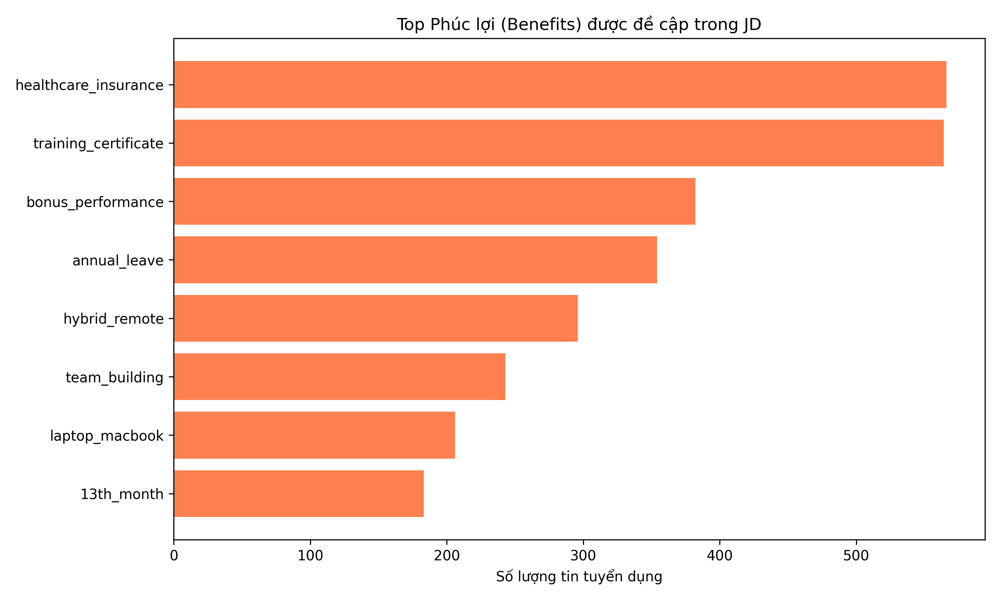

# 🔍 Trích Xuất Thông Tin (Information Extraction)
**File:** `dm_information_extraction.py` | **Độ khó:** 🟢 Dễ

Phân tích toàn bộ mô tả công việc IT để tự động trích xuất **phúc lợi (benefits)** và **kỹ năng mềm / ngoại ngữ (soft skills)** bằng kỹ thuật **Rule-based NLP (Regex)** — không cần model AI, không cần huấn luyện.

---

## 📋 Mục lục
- [Phương pháp](#-phương-pháp)
- [Input / Output](#-input--output)
- [Chi tiết các nhóm trích xuất](#-chi-tiết-các-nhóm-trích-xuất)
- [Cách chạy](#-cách-chạy)
- [Kết quả thực tế](#-kết-quả-thực-tế)

---

## 🧠 Phương pháp

Kỹ thuật sử dụng: **Rule-based Named Entity Recognition (NER)** bằng Regular Expressions (Regex).

```text
Mô tả công việc (text)
        │
        ▼
  Lowercase toàn bộ văn bản
        │
        ▼
  Duyệt qua từng pattern Regex
  (song ngữ Anh + Việt)
        │
        ├── Match Benefits?   → Tăng đếm benefit
        └── Match Soft Skill? → Tăng đếm soft skill
        │
        ▼
  Tổng hợp tần suất → Báo cáo + Biểu đồ
```

**Ưu điểm của Rule-based NLP:**
- Không cần dữ liệu training, chạy được ngay.
- Kết quả có thể giải thích rõ ràng (explainable).
- Hỗ trợ song ngữ Tiếng Việt + Tiếng Anh trong cùng một pattern.

---

## 📂 Input / Output

### Input
| File | Mô tả |
|------|-------|
| `data/processed/Data_ITJOB_Cleaned.csv` | Dữ liệu IT Job đã làm sạch, cột `description_clean` |

### Output
| File | Mô tả |
|------|-------|
| `data/mining_results/information_extraction_report.txt` | Báo cáo tần suất benefits & soft skills |
| `data/mining_results/top_benefits.png` | Biểu đồ bar chart phúc lợi phổ biến |

---

## 📌 Chi tiết các nhóm trích xuất

### 🎁 Phúc lợi (Benefits) — 8 nhóm

| Nhóm | Từ khóa nhận diện |
|------|-------------------|
| `healthcare_insurance` | "health care", "insurance", "bảo hiểm", "medical" |
| `training_certificate` | "training", "certificate", "sponsorship", "đào tạo" |
| `bonus_performance` | "performance bonus", "thưởng", "incentive" |
| `annual_leave` | "annual leave", "paid leave", "phép năm", "nghỉ phép" |
| `hybrid_remote` | "hybrid", "remote", "work from home", "WFH", "flexible" |
| `team_building` | "team building", "company trip", "outing" |
| `laptop_macbook` | "macbook", "laptop", "device" |
| `13th_month` | "13th month", "tháng 13" |

### 💬 Kỹ năng mềm & Ngoại ngữ (Soft Skills) — 5 nhóm

| Nhóm | Từ khóa nhận diện |
|------|-------------------|
| `communication` | "communication", "giao tiếp" |
| `english` | "english", "tiếng anh" |
| `teamwork` | "teamwork", "team work", "làm việc nhóm" |
| `problem_solving` | "problem solving", "giải quyết vấn đề" |
| `japanese` | "japanese", "tiếng nhật" |

---

## ▶️ Cách chạy

```bash
# Cài thư viện (nếu chưa có)
pip install pandas matplotlib

# Chạy script
python ml/dm_information_extraction.py
```

---

## 📊 Kết quả thực tế

> Quét **2,064 tin tuyển dụng IT** từ `Data_ITJOB_Cleaned.csv`

### 🎁 Phúc lợi phổ biến (Benefits)

| Hạng | Phúc lợi | Số tin | Tỉ lệ |
|------|----------|--------|-------|
| 1 | 🏥 Bảo hiểm sức khỏe | 566 | **27.4%** |
| 2 | 📚 Đào tạo & Chứng chỉ | 564 | **27.3%** |
| 3 | 💰 Thưởng hiệu suất | 382 | 18.5% |
| 4 | 🌴 Phép năm | 354 | 17.2% |
| 5 | 🏠 Remote / Hybrid | 296 | 14.3% |
| 6 | 🎉 Team Building | 243 | 11.8% |
| 7 | 💻 Laptop / MacBook | 206 | 10.0% |
| 8 | 🎁 Tháng 13 | 183 | 8.9% |

### 💬 Kỹ năng mềm & Ngoại ngữ

| Hạng | Kỹ năng | Số tin | Tỉ lệ |
|------|---------|--------|-------|
| 1 | 🗣️ Giao tiếp | 530 | **25.7%** |
| 2 | 🇬🇧 Tiếng Anh | 420 | **20.3%** |
| 3 | 🤝 Làm việc nhóm | 133 | 6.4% |
| 4 | 🧩 Giải quyết vấn đề | 107 | 5.2% |
| 5 | 🇯🇵 Tiếng Nhật | 73 | 3.5% |

### 📈 Biểu đồ phúc lợi



---

> **Nhận xét:** Bảo hiểm sức khỏe và cơ hội đào tạo là hai phúc lợi được đề cập nhiều nhất (~27%), cho thấy thị trường IT Việt Nam cạnh tranh mạnh trên yếu tố phát triển nghề nghiệp. Kỹ năng giao tiếp (25.7%) và tiếng Anh (20.3%) là hai soft skills được yêu cầu hàng đầu.
