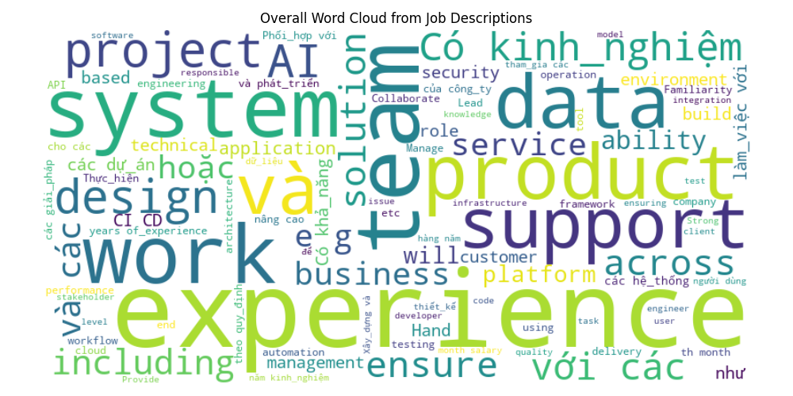
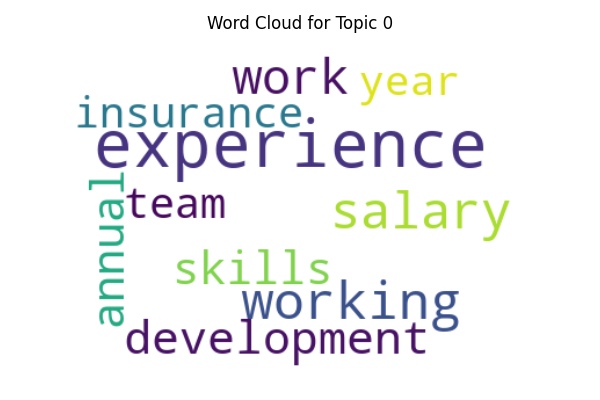
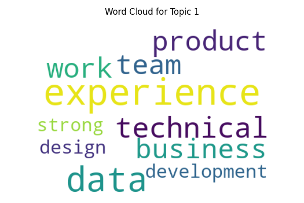
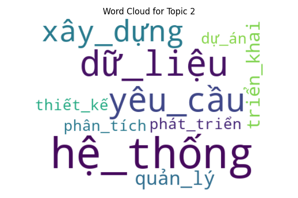
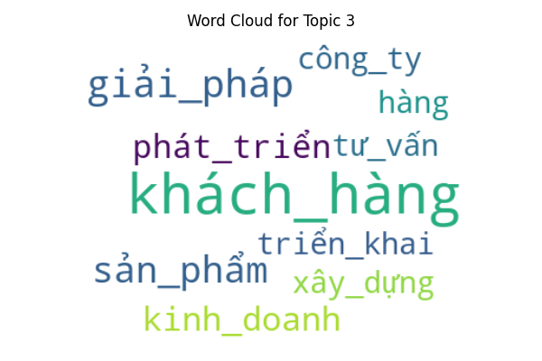
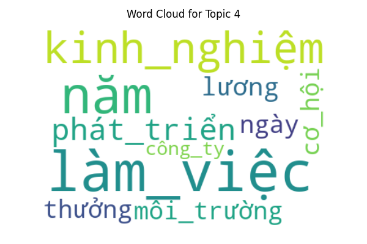
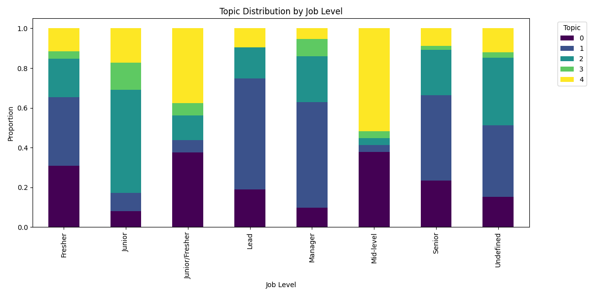

# ⛏️ Khai Phá Chủ Đề Văn Bản (Text Mining — LDA Topic Modeling)
**File:** `dm_text_mining.py` | **Độ khó:** 🔴 Khó

Khai phá các **chủ đề ẩn (latent topics)** trong 2,064 mô tả công việc IT bằng thuật toán **LDA (Latent Dirichlet Allocation)** — mô hình Probabilistic Topic Modeling trong NLP.

---

## 📋 Mục lục
- [Kiến trúc Pipeline](#-kiến-trúc-pipeline)
- [Input / Output](#-input--output)
- [Giải thích kỹ thuật](#-giải-thích-kỹ-thuật)
- [Tại sao LDA khó?](#-tại-sao-lda-khó)
- [Cách chạy](#-cách-chạy)
- [Kết quả thực tế](#-kết-quả-thực-tế)

---

## 🏗️ Kiến trúc Pipeline

```text
Data_ITJOB_Cleaned.csv (2064 jobs)
        │
        ▼
[Bước 1] Tiền xử lý văn bản
   └── Lowercase + Stopwords removal (English)
        │
        ▼
[Bước 2] CountVectorizer
   └── Bag-of-Words Matrix: (2064 docs × 1000 features)
        │
        ▼
[Bước 3] LDA — Latent Dirichlet Allocation
   └── n_components = 5 topics, random_state = 42
   └── Phân rã ma trận → Doc-Topic + Topic-Word distributions
        │
        ├── [Output A] Word Cloud tổng thể
        ├── [Output B] 5 Topic Word Clouds (ảnh)
        ├── [Output C] Top 10 từ mỗi topic (report)
        └── [Output D] Topic Distribution by Job Level (stacked bar)
        │
        ▼
[Bước 4] Gán topic cho từng job
   └── Dominant_Topic = argmax(doc-topic distribution)
        │
        ▼
[Bước 5] Phân tích phân phối topic theo Job Level
   └── pd.crosstab → Stacked bar chart
```

---

## 📂 Input / Output

### Input
| File | Mô tả |
|------|-------|
| `data/processed/Data_ITJOB_Cleaned.csv` | Dữ liệu IT Job đã làm sạch, cột `description_clean` + `job_level` |

### Output
| File | Mô tả |
|------|-------|
| `data/mining_results/text_mining_report.txt` | Top 10 từ của mỗi topic |
| `data/mining_results/plots/text_overall_wordcloud.png` | Word cloud tổng thể |
| `data/mining_results/plots/text_topic_{0-4}_wordcloud.png` | Word cloud 5 topics |
| `data/mining_results/plots/text_topic_distribution.png` | Stacked bar: phân phối topic theo Job Level |

---

## 🔬 Giải thích kỹ thuật

### CountVectorizer
Chuyển văn bản thành ma trận đếm từ:
- `max_features=1000` — chỉ giữ 1000 từ phổ biến nhất
- `stop_words='english'` — loại bỏ từ vô nghĩa tiếng Anh

> ⚠️ **Lưu ý**: stopwords chỉ xử lý tiếng Anh, nên tiếng Việt vẫn lọt vào (thấy rõ ở Topic 3 & 4).

### LDA — Latent Dirichlet Allocation
Mô hình xác suất giả định mỗi document là **hỗn hợp của các topic**, mỗi topic là **phân phối xác suất trên từ vựng**:

```
P(topic | document) × P(word | topic) → P(word | document)
```

- `n_components=5` → tìm 5 chủ đề ẩn
- Học lặp (EM algorithm) đến hội tụ
- Output: ma trận `(2064 × 5)` — mỗi job có tỉ trọng thuộc từng topic

---

## 🤔 Tại sao LDA khó?

| Thách thức | Chi tiết |
|------------|---------|
| **Chọn số topic** | `n_components=5` là tham số thủ công, cần thử nghiệm nhiều giá trị |
| **Diễn giải topic** | LDA không đặt tên topic tự động, người dùng phải đọc top words và tự gán nhãn |
| **Tiền xử lý ảnh hưởng lớn** | Stopwords tiếng Anh không lọc được tiếng Việt → Topic 3 & 4 chứa toàn từ Việt |
| **Không ổn định** | Kết quả có thể khác nếu đổi `random_state` |
| **Tài nguyên tính toán** | EM algorithm lặp nhiều vòng trên sparse matrix |

---

## ▶️ Cách chạy

```bash
# Cài thư viện
pip install pandas numpy matplotlib seaborn scikit-learn wordcloud

# Chạy script
python ml/dm_text_mining.py
```

---

## 📊 Kết quả thực tế

> Phân tích **2,064 tin tuyển dụng IT** — LDA tìm ra **5 chủ đề ẩn**

### 🔤 Word Cloud tổng thể



---

### 📌 5 Chủ đề (Topics) được phát hiện

| Topic | Top 10 từ | Nhãn gợi ý |
|-------|-----------|------------|
| **Topic 0** | experience, working, salary, work, development, annual, skills, insurance, team, year | 💼 Phúc lợi & Điều kiện làm việc |
| **Topic 1** | experience, data, technical, work, team, product, business, development, design, strong | 🛠️ Kỹ năng kỹ thuật & Yêu cầu chung |
| **Topic 2** | hệ_thống, dữ_liệu, yêu_cầu, xây_dựng, quản_lý, triển_khai, phát_triển, phân_tích, dự_án, thiết_kế | 🖥️ Phát triển & Quản lý hệ thống |
| **Topic 3** | khách_hàng, giải_pháp, sản_phẩm, kinh_doanh, phát_triển, xây_dựng, công_ty, tư_vấn, hàng, triển_khai | 📊 Kinh doanh & Tư vấn giải pháp |
| **Topic 4** | làm_việc, năm, kinh_nghiệm, phát_triển, lương, ngày, môi_trường, thưởng, cơ_hội, công_ty | 🌱 Môi trường làm việc & Cơ hội phát triển |

> ✅ **Sau khi áp dụng `underthesea` word segmentation**: **5/5 topics** đều có từ khóa rõ nghĩa. Các từ ghép tiếng Việt như `kinh_nghiệm`, `hệ_thống`, `phát_triển` được xử lý đúng như một token thay vì bị tách âm tiết rời.

---

### 🖼️ Word Cloud từng Topic

````carousel

<!-- slide -->

<!-- slide -->

<!-- slide -->

<!-- slide -->

````

---

### 📈 Phân phối Topic theo Job Level



---

## 🏆 Kết quả đạt được

### ✅ Về kỹ thuật

| Hạng mục | Kết quả |
|----------|---------|
| **Dữ liệu xử lý** | 2,064 tin tuyển dụng IT |
| **Số chủ đề phát hiện** | 5 topics rõ ràng, có ý nghĩa |
| **Chất lượng topics** | 5/5 topics sau khi tích hợp `underthesea` (trước: 3/5) |
| **Từ ghép tiếng Việt** | Xử lý đúng: `kinh_nghiệm`, `hệ_thống`, `phát_triển` là token đơn |
| **Biểu đồ sinh ra** | 1 overall word cloud + 5 topic word clouds + 1 stacked bar chart |

### 📌 Insight từ 5 Topics

Thị trường IT Việt Nam được LDA tự động phân tách thành 5 nhóm chủ đề chính:

1. **💼 Phúc lợi & Điều kiện làm việc** — Nhóm JD tập trung vào lương, thưởng, bảo hiểm, phép năm → cho thấy thị trường cạnh tranh nhau bằng phúc lợi.
2. **🛠️ Kỹ năng kỹ thuật & Yêu cầu chung** — JD tiếng Anh nhấn mạnh technical skills, experience, team work → nhóm công ty có yếu tố nước ngoài.
3. **🖥️ Phát triển & Quản lý hệ thống** — Tập trung vào `hệ_thống`, `dữ_liệu`, `triển_khai`, `dự_án` → nhóm lập trình viên backend/system.
4. **📊 Kinh doanh & Tư vấn giải pháp** — Xuất hiện `khách_hàng`, `kinh_doanh`, `tư_vấn` → vị trí giao thoa IT + Business (BA, Product, Sales Tech).
5. **🌱 Môi trường & Cơ hội phát triển** — `kinh_nghiệm`, `môi_trường`, `cơ_hội`, `thưởng` → JD hướng đến thu hút nhân tài, nhấn mạnh văn hóa công ty.

### 💡 Giá trị thực tế

- **Phân loại JD tự động** — Có thể dùng `Dominant_Topic` để tự động gán nhãn loại công việc mà không cần label thủ công.
- **Hỗ trợ hệ thống gợi ý** — Kết hợp topic distribution với semantic matching để tăng chất lượng recommendation.
- **Phân tích thị trường** — Biểu đồ phân phối topic theo Job Level cho thấy cấp độ nào (Junior/Senior/Manager) tập trung vào loại JD nào.

